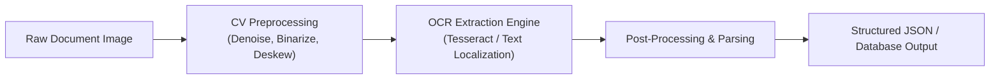

<div align="center">

# 🔍 OCR SIPW — Document AI & Intelligent Data Extraction

An automated Computer Vision & OCR pipeline engineered to extract, preprocess, and structure text from administrative and commercial document images.

[](https://www.python.org/)
[](https://opencv.org/)
[](LICENSE)

[Product Context](#-business--product-context) • [Pipeline Architecture](#-pipeline-architecture) • [Getting Started](#-getting-started)

</div>

---

## 💼 Business & Product Context

Manual document data entry is notoriously slow, costly, and error-prone. **OCR SIPW** was created to automate the intake and parsing of scanned physical forms, receipts, and administrative records—converting unsearchable raster images into machine-readable structured datasets with minimal human intervention.

---

## ⚡ Technical Pipeline



### ✨ Core Capabilities
- 📷 **Adaptive Image Enhancement**: Adaptive thresholding and morphological filtering to handle varied lighting, low scan contrast, and perspective skews.
- 🔤 **High-Fidelity Text Extraction**: Character and word recognition optimized for tabular and structured form formats.
- ⚙️ **Automated Export**: Direct pipeline for dumping extracted key-value pairs into structured text or JSON formats for downstream ERP/accounting integration.

---

## 🛠️ Installation & Usage

```bash
# Clone repository
git clone https://github.com/zulilmiihsn/ocr-sipw.git
cd ocr-sipw

# Setup environment
python -m venv venv
source venv/bin/activate  # On Windows: .\venv\Scripts\activate

# Install dependencies
pip install -r requirements.txt

# Run extraction pipeline
python main.py --input /path/to/document.jpg
```

---

<div align="center">
  Crafted by <a href="https://github.com/zulilmiihsn"><strong>Zul Ilmi Ihsan</strong></a> • AI Product Engineer
</div>
